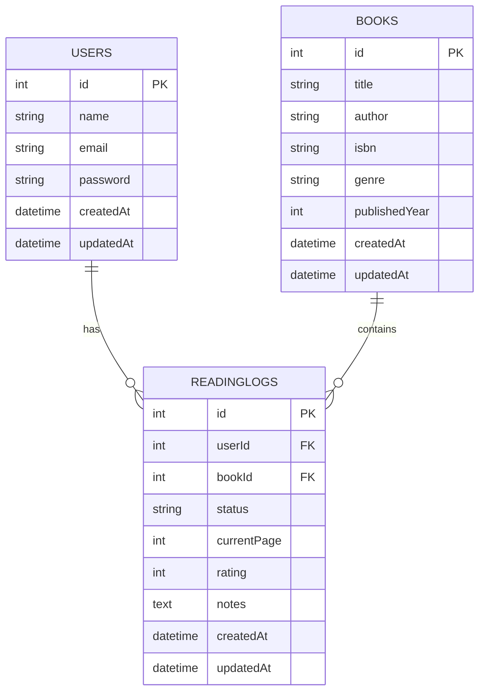

# 📚 ShelfLife

ShelfLife is a backend API for tracking reading activity, managing personal book lists, and joining book clubs.  
It is built as a capstone project to demonstrate backend engineering skills using **Node.js, Express, PostgreSQL, and modern best practices**.

---

## 🚀 Features

- User authentication with JWT
- Track reading progress with statuses: _Want to Read, Reading, Finished_
- Manage books in the system (CRUD)
- Write and view reviews for books
- Join book clubs and collaborate with other readers _(future feature)_
- Clear error handling with appropriate response codes
- Swagger API documentation

---

## 🛠️ Technologies Used

- **Backend**: Node.js, Express
- **Database**: PostgreSQL (hosted on Render)
- **ORM/Database Tools**: Sequelize or Prisma
- **Authentication**: JWT + bcrypt for password hashing
- **Documentation**: Swagger/OpenAPI
- **Testing**: Jest + Supertest
- **Deployment**: Render
- **Version Control**: GitHub + GitHub Projects

---

## 🗄️ Database Schema (Planned)

- **Users** → manage authentication and profiles
- **Books** → catalog of books
- **UserBooks** → tracks each user’s reading status
- **Reviews** → user-submitted reviews for books
- **Clubs** → reading groups for collaboration _(future work)_
- **ClubMembers** → join table between users and clubs

---

## 🔑 API Overview (Planned)

**Auth**

- `POST /auth/register` → Register a new user
- `POST /auth/login` → Login and receive a JWT

**Users**

- `GET /users/me` → Get current user profile
- `PUT /users/me` → Update profile
- `DELETE /users/me` → Delete account

**Books**

- `POST /books` → Add new book
- `GET /books` → List books (with filters)
- `GET /books/:id` → Get book details
- `PUT /books/:id` → Update book (admin only) (future)
- `DELETE /books/:id` → Remove book (admin only) (future)

**Reading Status**

- `POST /user-books` → Add a book to user’s reading list
- `PUT /user-books/:id` → Update status or rating
- `DELETE /user-books/:id` → Remove book from list

**Reviews**

- `POST /books/:id/reviews` → Add review for a book
- `GET /books/:id/reviews` → Get reviews for a book
- `DELETE /reviews/:id` → Delete review

**Clubs (Future Feature)**

- `POST /clubs` → Create a book club
- `GET /clubs` → List all clubs
- `POST /clubs/:id/join` → Join a club
- `POST /clubs/:id/books` → Add a book to a club’s reading list

---

## 🧪 Testing

Unit and integration tests are written with **Jest** and **Supertest** to validate:

- Authentication
- CRUD operations for books
- Reading status updates
- Review creation & retrieval

---

## 📖 Documentation

Swagger UI will be used to document all endpoints.  
Once deployed, documentation will be available at:

## 📊 Database Schema

ShelfLife uses a relational PostgreSQL database with Sequelize ORM.  
The schema models the relationships between **Users**, **Books**, and **ReadingLogs**.

